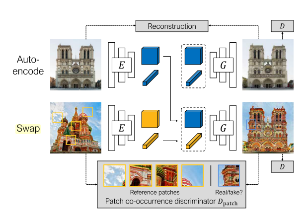
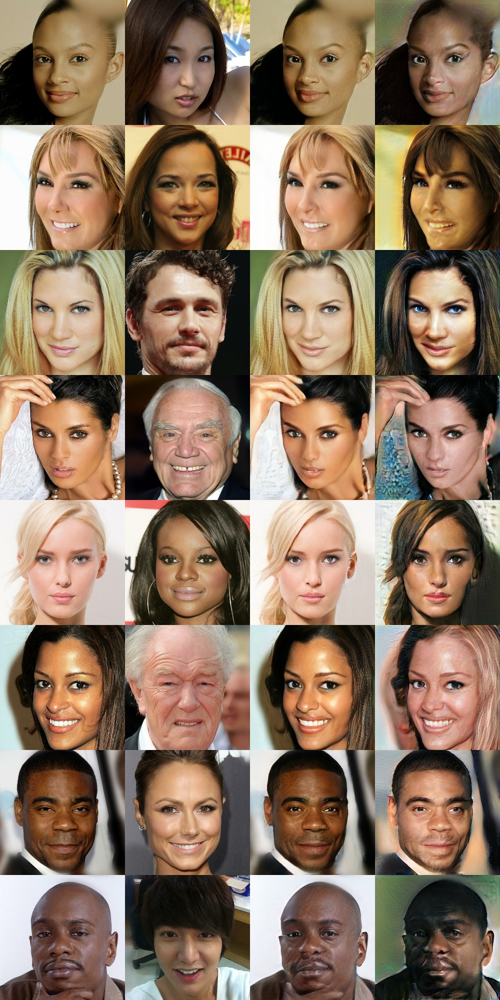
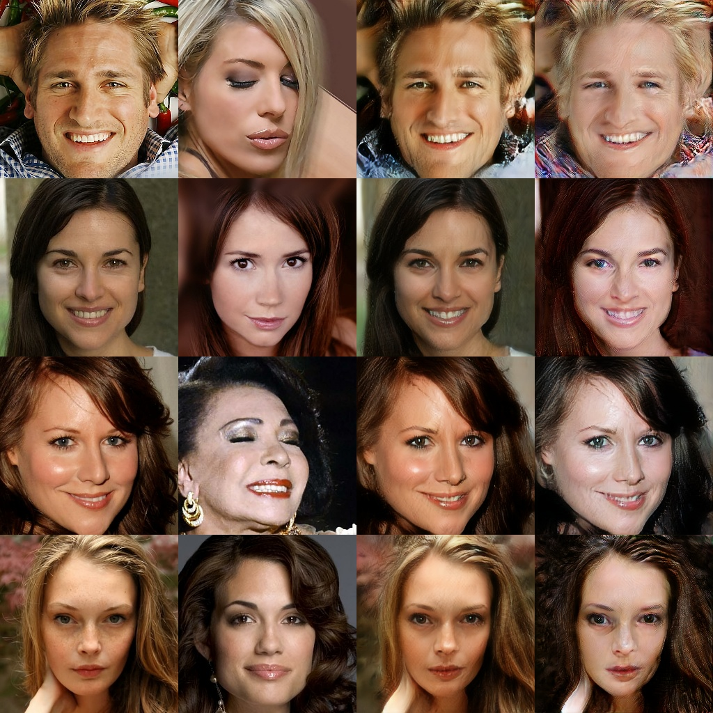

# swapping-autoencoder-tf
The unofficial  tensorflow implementation of Swapping Autoencoder for Deep Image Manipulation. Pdf linking: [Swapping AutoEncoder](https://arxiv.org/abs/2007.00653)



# Differences

This implementation has three main differences with original paper.

- trained on 256x256 images, not 512 

- Use AdaIn, not modulation/demodulation layer. We will update it in the next few days.

## Dependencies

```bash
Python=3.6
tensorflow=1.14
pip install -r requirements.txt

```
Or Using Conda

```bash
-conda create -name SAE python=3.6
-conda install tensorflow-gpu=1.14 or higher
```
Other packages installed by pip.

## Usage

- Clone this repo:
```bash
git clone https://github.com/zhangqianhui/swapping-autoencoder-tf
cd swapping-autoencoder-tf

```

- Download the CelebAHQ dataset

  Download the tar of CelebAGaze dataset from [Google Driver Linking](https://github.com/switchablenorms/CelebAMask-HQ).
    
- Train the model using command line with python

```bash
python train.py --gpu_id=0 --exper_name='log10_10_1' --data_dir='../dataset/CelebAMask-HQ/CelebA-HQ-img/'
```
- Test the model

```bash
python test.py --gpu_id=0 --exper_name='log10_10_1' --data_dir='../dataset/CelebAMask-HQ/CelebA-HQ-img/'
```

Or Using scripts for training 

```bash
bash scripts/train_log10_10_1.sh
```

For testing

```bash
bash scripts/test_log10_10_1.sh
```

## Experiment Result with 50000 iterations

Training results on CelebAHQ. 1st-4th colums are structure input, texture input, reconstruction, swapped



Testing results on CelebAHQ. 1st-4th colums are structure input, texture input, reconstruction, swapped



